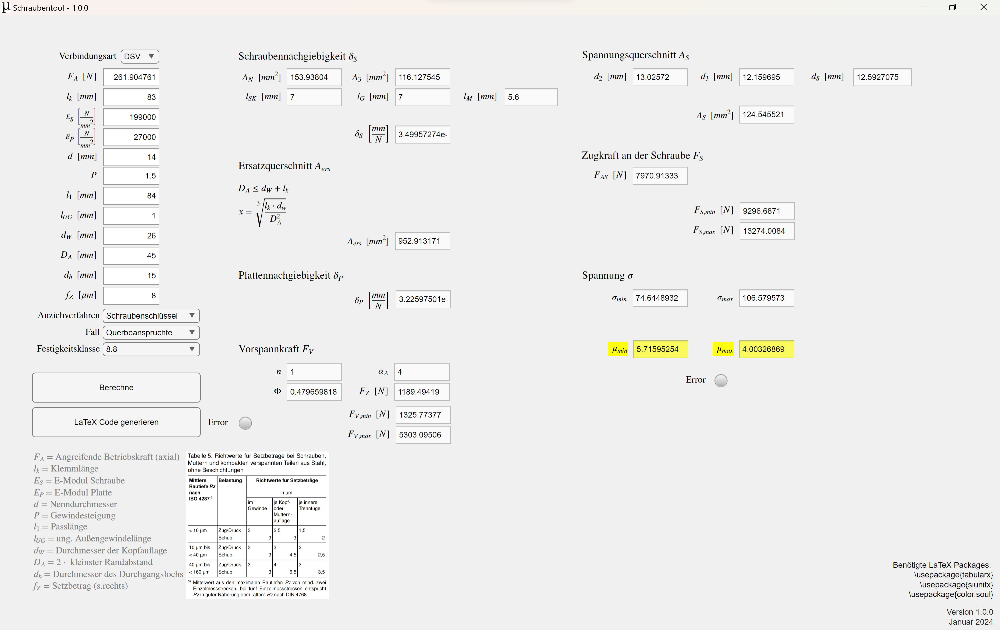

# Schraubentool

Dieses Programm berechnet anhand von Schraubeneigenschaften, wie Abmaße und Materialeigenschaften, und der Größe einer angreifenden Zugkraft, ob die Schrauben diese Kraft aushalten. Zwischenergebnisse werden auch angezeigt und LaTeX Code für den Festigkeitsnachweis lässt sich generieren - mit Formeln.

## Inhaltsangabe

- [Installation](#installation)
- [Anwendung](#anwendung)
- [Troubleshooting](#troubleshooting)
- [Beitragen](#beitragen)
- [Lizenz](#lizenz)

## Installation

Um die App zu installieren, lade die Datei [`schraubentoolInstaller.exe`](schraubentoolInstaller.exe) herunter und führe sie aus. Folge dann den Anweisungen im Installationsmenü.

## Anwendung

Wenn du die App asuführst und auf 'Berechne' drückst, sollte dein Fenster so aussehen:

Mit der linken spalte steuerst du die App. Hier gibst du relevante Parameter ein, startest die Berechnung und generierst den LaTeX code.

Die zwei rechten Spalten zeigen dir die Ergebnisse.

Falls du wissen möchtest, wie die Werte berechnet werden, lies bitte das [Wiki](https://github.com/muederotter/schraubentool/wiki).

## Troubleshooting

Ich habe zwei Errorlämpchen eingebaut. Wenn das linke lämpchen leuchtet, dann liegt das meistens daran, dass der Ordner `C:\temp` nicht existiert. Hier wird nämlich die temporäre Textdatei mit dem LaTeX code gespeichert. In diesem fall erstelle den Ordner bitte manuell, dann sollte alles funktionieren.

Wenn du sonstige Probleme mit der App hast oder Fehler entdeckst, dann erstelle bitte ein [Issue](https://github.com/muederotter/schraubentool/issues).

## Beitragen

Hilfe ist immer willkommen! Bitte folge den Richtlinen in [CONTRIBUTING.md](CONTRIBUTING.md).

## Lizenz

Dieses Projekt ist lizensiert unter der [MIT License](LICENSE).
